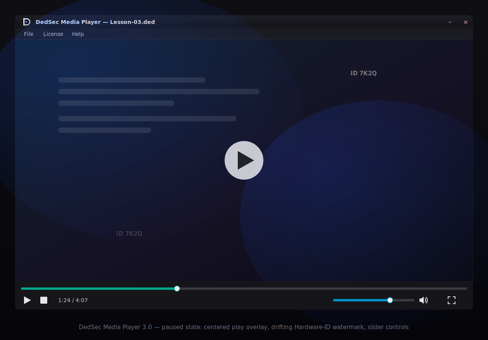

# DedSec-Media-Player
DedSec Media Player 3.0 is a secure desktop media player designed for organizations, educators, and content creators who need controlled offline or online distribution of premium video content.

# DedSec Media Player 3.0

  

<h1 align="center">DedSec Media Player 3.0</h1>

  <strong>Highly Protected Encrypted Media Player</strong> 
  Secure • Encrypted • Hardware Bound • Enterprise Ready

---

## Features

- 🔒 Encrypted Video Playback
- 🖥️ Hardware ID Licensing
- 🛡️ Multi-layer Protection
- 📹 Secure Playback
- ⚡ High Performance
## Highly Protected Encrypted Media Player

The player is built around a layered security model that combines encrypted media playback, device authorization, runtime integrity verification, and multiple anti-analysis techniques to help reduce unauthorized access and redistribution.

Our goal is to make premium content significantly harder to copy while maintaining a smooth playback experience for legitimate users.

> **Note:** No client-side protection can guarantee absolute security. DedSec Media Player follows a defense-in-depth approach that combines multiple security mechanisms to raise the difficulty and cost of unauthorized copying.

---

## Features

### Encrypted Video Playback

* AES + CHACHA encrypted media support
* On-the-fly decryption during playback
* No permanently decrypted files stored on disk
* Secure key handling
* Fast startup and optimized streaming

### Device Authorization

* Hardware ID (HWID) licensing
* Device activation system
* License verification

### Content Protection

* Multiple layers of runtime protection
* Integrity verification
* Tamper detection
* Runtime validation
* Secure playback environment

### Screen Capture Protection

* Screenshot detection and prevention (where supported by the operating system)
* Screen recording detection (best effort)
* Overlay protection
* Protected playback mode

### Environment Detection

* Virtual machine detection
* Sandbox detection
* Remote Desktop (RDP) detection
* Debugger detection
* Emulator detection
* Analysis environment detection

### Security

* Encrypted configuration
* Secure licensing
* Memory protection techniques
* Runtime validation
* Encrypted communication
* Secure update verification

### Performance

* Lightweight architecture
* Fast encrypted playback
* Low memory usage
* GPU accelerated rendering (when available)
* Optimized decoding pipeline

---

# Use Cases

DedSec Media Player is suitable for:

* Online video courses
* Corporate training
* Premium educational content
* Internal company videos
* Licensed media distribution
* Private video libraries
* Enterprise content delivery

---

# Why DedSec Media Player?

Most standard media players focus primarily on playback.

DedSec Media Player focuses on secure content distribution by combining encryption, licensing, runtime integrity checks, and environment validation to help reduce unauthorized access and redistribution while providing a seamless experience for authorized users.

---

# Security Philosophy

Security is built using a defense-in-depth approach.

Rather than relying on a single protection mechanism, the player combines several independent security layers including:

* Encryption
* Licensing
* Device binding
* Runtime validation
* Tamper detection
* Environment checks
* Integrity verification

This layered approach is intended to increase resilience against reverse engineering and unauthorized redistribution.

---

# Commercial Solutions

We also develop custom secure media players tailored to specific business requirements.

Possible customizations include:

* Custom branding
* White-label solutions
* Custom licensing systems
* LMS integration
* Custom authentication
* Enterprise deployment
* Offline activation
* Online activation
* API integration
* Personalized user interface

---

# Roadmap

* Improved licensing
* Enhanced update system
* Cross-platform support
* Cloud license management
* Enterprise dashboard
* Analytics
* Advanced watermarking
* Additional content protection features

---

# Disclaimer

DedSec Media Player is intended for legitimate software licensing and content protection purposes.

While the application implements multiple security mechanisms, no client-side software can guarantee complete protection against a sufficiently capable attacker. Users should combine technical protections with appropriate legal, contractual, and operational measures.

---

# Contact

For commercial licensing, enterprise deployments, or custom secure media player development, please contact us through GitHub or your preferred business communication channel.

---

## License

Copyright © DedSec.

All rights reserved.

This repository is provided for demonstration and informational purposes unless otherwise specified.
